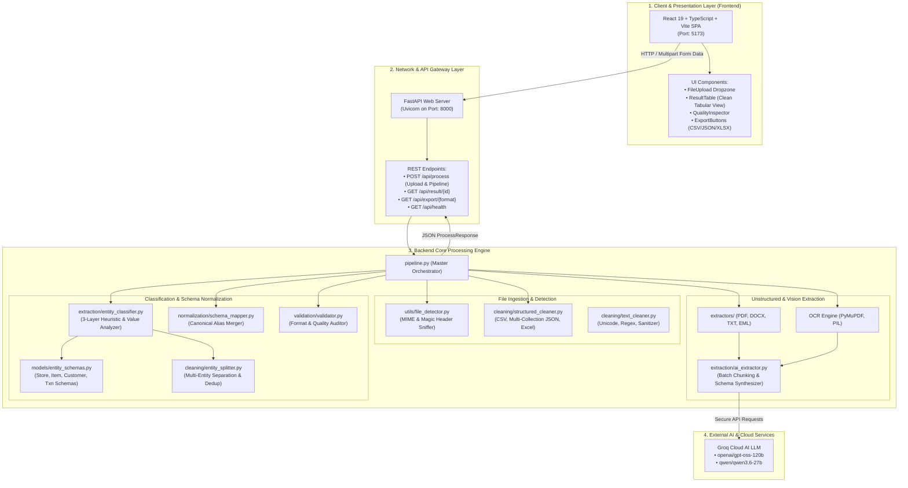

# DataFlow — Clean, Validated Structured Data Engine

A modern, high-performance data processing engine and web application that converts structured, unstructured, and multi-entity business files into clean, standardized, and validated datasets with multi-format export support (JSON, CSV, Excel).

---

## 🏗️ 1. Physical Architecture Overview

The system architecture separates presentation, API routing, pipeline orchestration, multi-entity intelligence, and cloud AI extraction:



---

## 🔄 2. End-to-End Workflow Overview

How files are ingested, detected, classified, separated, and normalized:

```mermaid
flowchart TD
    Start([User Uploads File]) --> DetectType[1. File Type & Format Sniffing]
    
    DetectType --> IsStruct{Is Structured or<br/>Unstructured?}

    %% STRUCTURED PATH
    IsStruct -->|Structured: CSV, Excel, JSON| CheckMultiColl{Is Multi-Collection JSON<br/>or Multi-Sheet Excel?}
    
    CheckMultiColl -->|Yes: Multiple JSON Keys / Sheets| ParseCollections[Parse Every Collection into DataFrames]
    ParseCollections --> LoopCollections[For Each Entity Collection]
    LoopCollections --> ClassifyColl[Classify Entity Type]
    ClassifyColl --> MapCollCanonical[Map to Canonical Schema & Deduplicate]
    MapCollCanonical --> SplitTablesOutput[Build Multi-Entity Split Tables]

    CheckMultiColl -->|No: Single Flat Table| CleanTable[Clean Nulls, Whitespace & Deduplicate]
    CleanTable --> ClassifyFlat[2. 3-Layer Entity Classification<br/>• Layer 1: Column Keyword Weights<br/>• Layer 2: Value Pattern Analysis<br/>• Layer 3: Co-Occurrence & Foreign Keys]
    
    ClassifyFlat --> IsMixed{Is File Mixed or<br/>Single-Entity?}
    
    IsMixed -->|Mixed: Contains 2+ Entities| SplitFlat[Separate Columns into Tables:<br/>🏪 Store | 📦 Product | 👤 Customer | 🧾 Transaction]
    SplitFlat --> DedupEntities[Deduplicate Master Entities<br/>& Preserve Transaction FKs]
    DedupEntities --> MapSeparated[Map Each Table to Canonical Schema]
    MapSeparated --> SplitTablesOutput

    IsMixed -->|Single-Entity: 1 Entity Type| DirectMapping[Direct Canonical Schema Mapping<br/>• Merge Duplicate Aliases<br/>• Combine Name Parts<br/>• Extract City/State]
    DirectMapping --> StandardizeSingle[Value Standardization<br/>• ISO 8601 Dates<br/>• Title Case Names<br/>• Clean Booleans & Numbers]

    %% UNSTRUCTURED PATH
    IsStruct -->|Unstructured: PDF, DOCX, TXT, Images| ExtractRawText[Extract Text & OCR Vision]
    ExtractRawText --> CleanUnicode[Normalize Unicode & Clean Artifacts]
    CleanUnicode --> CheckListEntries{Contains >= 6<br/>List / Paragraph Items?}
    
    CheckListEntries -->|Yes: Multi-Record Dataset| BatchChunking[Batch into 10-Item Chunks]
    BatchChunking --> GroqBatchCall[Groq LLM Batch Extraction<br/>max_tokens=8192]
    GroqBatchCall --> MergeRecords[Merge All Batch Records & Unify Headers]
    
    CheckListEntries -->|No: Single Document| SingleLLMCall[Groq LLM Document Synthesis]

    MergeRecords --> FinalizeData[Format Structured Records Table]
    SingleLLMCall --> FinalizeData
    StandardizeSingle --> FinalizeData
    SplitTablesOutput --> FinalizeData

    %% VALIDATION & AUDIT
    FinalizeData --> ValidateQuality[3. Data Validation & Quality Audit<br/>• Regex Semantic Validation<br/>• Deduplication Count<br/>• Missing Value Analysis]
    
    ValidateQuality --> UIOutput([Display in React UI & Enable Export<br/>JSON / CSV / Excel])
```

---

## 🛠️ Core Capabilities & Features

### 1. Multi-Entity vs Single-Entity Handling
* **Multi-Entity Datasets**: Separates mixed datasets into distinct tables:
  * 🏪 **Store Data**: `store_id`, `store_name`, `city`, `state`, `postal_code`, `active`, etc.
  * 📦 **Product / Item Data**: `item_id`, `item_name`, `category`, `selling_price`, `cost_price`, `stock_quantity`, `available`, etc.
  * 👤 **Customer Data**: `customer_id`, `full_name`, `email`, `phone`, `registered_on`, `loyalty_tier`, etc.
  * 🧾 **Transaction Data**: `transaction_id`, `store_id`, `item_id`, `customer_id`, `purchase_date`, `quantity`, `total_amount`, `payment_method`.
* **Single-Entity Datasets**: If the dataset contains only one entity (e.g. only Store Data or only Customer Data), the system bypasses separation and applies direct canonical schema mapping.

### 2. Multi-Record Unstructured Batching
* Automatically detects multi-record text documents (e.g. 50+ numbered employee profiles or transaction logs).
* Batches records in 10-item chunks with `max_tokens=8192` to ensure 100% complete extraction with zero token truncation.

### 3. Canonical Schema Normalization
* **Row-by-Row Alias Merging**: Coalesces values across duplicate alias columns (`STORE_ID`, `id`, `store_id` $\rightarrow$ `store_id`).
* **Name Combiner**: Automatically merges `first_name` + `last_name` into `full_name`.
* **Price Isolation**: Keeps retail `selling_price` strictly isolated from wholesale `cost_price`.
* **Value Standardizer**: ISO 8601 dates (`YYYY-MM-DD`), Title Case names, clean booleans, and normalized numbers.

---

## 🚀 Getting Started

### 1. Unified Launcher
```powershell
python run.py
```
Open **[http://localhost:8000](http://localhost:8000)** in your browser.

---

### 2. Development Mode

**Backend (FastAPI):**
```powershell
uvicorn backend.main:app --reload --port 8000
```

**Frontend (Vite + React):**
```powershell
cd frontend
npm run dev
```
Open **[http://localhost:5173](http://localhost:5173)**.

---

## 🧪 Testing Suite

Run the full regression test suite:
```powershell
python test_multi_entity_detection.py
python test_schema_mapping.py
python test_entity_classifier.py
python test_nested_json.py
python test_all_formats.py
python test_api_endpoints.py
```

---

## 📁 Project Structure

```
data clean/
├── backend/
│   ├── cleaning/              # Structured cleaner, entity splitter, text cleaner, data auditor
│   ├── extractors/            # Image, PDF, TXT, DOCX, Email extractors
│   ├── extraction/            # AI batch extractor, 3-layer entity classifier, field extractor
│   ├── normalization/         # Schema mapper, value standardizer, normalizer
│   ├── models/                # Canonical entity schemas & Pydantic response models
│   ├── routes/                # FastAPI routes (process, export, health)
│   ├── utils/                 # MIME & magic file type sniffer
│   ├── pipeline.py            # Master end-to-end processing pipeline
│   └── main.py                # FastAPI entrypoint
├── frontend/
│   ├── src/
│   │   ├── components/        # ResultTable, FileUpload, QualityInspector, ExportButtons
│   │   ├── pages/             # UploadPage, ProcessingPage, ResultPage
│   │   ├── services/          # API service client
│   │   └── types/             # TypeScript schema definitions
│   └── package.json
├── sample_data/               # Test fixtures (CSV, Excel, JSON, TXT, DOCX, EML)
├── run.py                     # Single-command runner
└── README.md                  # Project documentation & architecture
```
