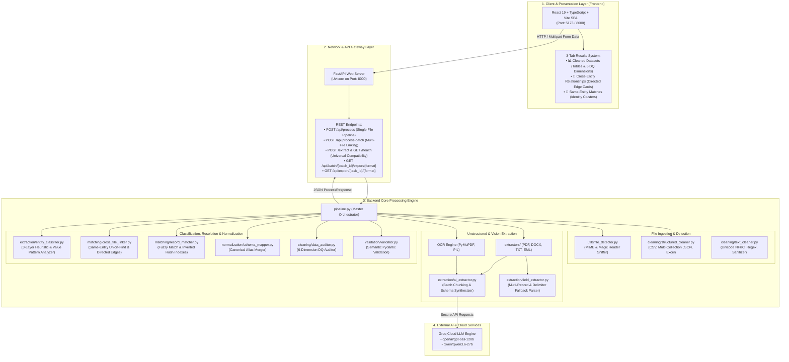

# DataFlow — Intelligent Unstructured Data & Multi-Entity Resolution Engine

DataFlow is an advanced, end-to-end data processing system and web application designed to automatically extract, clean, categorize, normalize, and resolve entities across diverse structured and unstructured document formats. It transforms heterogeneous raw files into standardized, database-ready tables and cross-file relationship graphs without requiring manual schema definitions.

---

## 🎯 Problem & Solution Statement

### ❌ Final Problem Statement
> **Existing systems can extract text from unstructured files, but they often fail to automatically understand the data structure, identify separate records, determine appropriate fields, and convert the extracted information into a clean structured format. Fixed rules and predefined schemas are not flexible enough for documents with different layouts and wording.**

### ✅ Final Solution Statement
> **Develop a dynamic unstructured-data processing system that extracts content from files, cleans the extracted text, automatically identifies the entity and schema, separates individual records, maps values to standardized fields, normalizes and validates the data, and generates structured JSON, CSV, Excel, or database-ready output. This allows different types of unstructured data to be converted into a consistent table without manually defining the structure for every new document.**

---

## 🏗️ 1. Physical Architecture Overview

The system architecture separates presentation, API routing, pipeline orchestration, multi-entity intelligence, and cloud AI extraction:


```mermaid
graph TB
    subgraph Client_Layer ["1. Client & Presentation Layer (Frontend)"]
        UI["React 19 + TypeScript + Vite SPA<br/>(Port: 5173 / 8000)"]
        Tabs["3-Tab Results System:<br/>• 📊 Cleaned Datasets (Tables & 6 DQ Dimensions)<br/>• 🔗 Cross-Entity Relationships (Directed Edge Cards)<br/>• 👥 Same-Entity Matches (Identity Clusters)"]
        UI --> Tabs
    end

    subgraph API_Gateway ["2. Network & API Gateway Layer"]
        FastAPI["FastAPI Web Server<br/>(Uvicorn on Port: 8000)"]
        Endpoints["REST Endpoints:<br/>• POST /api/process (Single File Pipeline)<br/>• POST /api/process-batch (Multi-File Linking)<br/>• POST /extract & GET /health (Universal Compatibility)<br/>• GET /api/batch/{batch_id}/export/{format}<br/>• GET /api/export/{task_id}/{format}"]
        FastAPI --> Endpoints
    end

    subgraph Processing_Engine ["3. Backend Core Processing Engine"]
        Pipeline["pipeline.py (Master Orchestrator)"]
        
        subgraph Ingestion_Module ["File Ingestion & Detection"]
            FileDetector["utils/file_detector.py<br/>(MIME & Magic Header Sniffer)"]
            StructCleaner["cleaning/structured_cleaner.py<br/>(CSV, Multi-Collection JSON, Excel)"]
            TextCleaner["cleaning/text_cleaner.py<br/>(Unicode NFKC, Regex, Sanitizer)"]
        end

        subgraph Extraction_Module ["Unstructured & Vision Extraction"]
            DocExtract["extractors/ (PDF, DOCX, TXT, EML)"]
            VisionExtract["OCR Engine (PyMuPDF, PIL)"]
            AIExtract["extraction/ai_extractor.py<br/>(Batch Chunking & Schema Synthesizer)"]
            RuleExtract["extraction/field_extractor.py<br/>(Multi-Record & Delimiter Fallback Parser)"]
        end

        subgraph Intelligence_Module ["Classification, Resolution & Normalization"]
            Classifier["extraction/entity_classifier.py<br/>(3-Layer Heuristic & Value Pattern Analyzer)"]
            Linker["matching/cross_file_linker.py<br/>(Same-Entity Union-Find & Directed Edges)"]
            Matcher["matching/record_matcher.py<br/>(Fuzzy Match & Inverted Hash Indexes)"]
            Mapper["normalization/schema_mapper.py<br/>(Canonical Alias Merger)"]
            Auditor["cleaning/data_auditor.py<br/>(6-Dimension DQ Auditor)"]
            Validator["validation/validator.py<br/>(Semantic Pydantic Validation)"]
        end
    end

    subgraph External_AI ["4. External AI & Cloud Services"]
        GroqAPI["Groq Cloud LLM Engine<br/>• openai/gpt-oss-120b<br/>• qwen/qwen3.6-27b"]
    end

    %% Connections
    UI -->|HTTP / Multipart Form Data| FastAPI
    Endpoints --> Pipeline
    Pipeline --> FileDetector
    Pipeline --> StructCleaner
    Pipeline --> DocExtract
    Pipeline --> VisionExtract
    DocExtract --> AIExtract
    DocExtract --> RuleExtract
    VisionExtract --> AIExtract
    AIExtract -->|Secure API Requests| GroqAPI
    Pipeline --> Classifier
    Pipeline --> Linker
    Pipeline --> Matcher
    Pipeline --> Mapper
    Pipeline --> Auditor
    Pipeline --> Validator
    Pipeline -->|JSON ProcessResponse| Endpoints
```

---

## 🔄 2. End-to-End Processing Workflow

```mermaid
flowchart TD
    Start([User Uploads Single or Multiple Files]) --> DetectType[1. File Type Sniffing & MIME Detection]
    
    DetectType --> IsStruct{Is Structured or<br/>Unstructured?}

    %% STRUCTURED PATH
    IsStruct -->|Structured: CSV, Excel, JSON| CleanStruct[Clean Inconsistent Nulls, Whitespace & Deduplicate]
    CleanStruct --> ClassifyFlat[2. 3-Layer Entity Classification<br/>• Keyword Weights<br/>• Value Pattern Regex<br/>• Co-Occurrence Rules]
    
    ClassifyFlat --> IsMixed{Is File Mixed or<br/>Single-Entity?}
    
    IsMixed -->|Mixed: Contains 2+ Entities| SplitFlat[Separate Columns into Tables:<br/>🏪 Store | 📦 Product | 👤 Customer | 🧾 Transaction]
    SplitFlat --> DedupEntities[Deduplicate Master Entities<br/>& Preserve Transaction FKs]
    DedupEntities --> MapSeparated[Map Each Table to Canonical Schema]

    IsMixed -->|Single-Entity: 1 Entity Type| DirectMapping[Direct Canonical Schema Mapping<br/>• Merge Duplicate Aliases<br/>• Combine Name Parts<br/>• Extract City/State]
    DirectMapping --> StandardizeSingle[Value Standardization<br/>• ISO 8601 Dates<br/>• Title Case Names<br/>• Clean Numbers]

    %% UNSTRUCTURED PATH
    IsStruct -->|Unstructured: PDF, DOCX, TXT, OCR Images, EML| ExtractRaw[Extract Raw Text & Computer Vision OCR]
    ExtractRaw --> CleanUnicode[Clean Unicode NFKC & Strip Artifacts]
    CleanUnicode --> CheckAI{Is LLM API Available?}
    
    CheckAI -->|Yes| BatchChunking[Batch into 10-Item Chunks / Document Synthesis]
    BatchChunking --> FormatTable[Generate Standardized Records Table]
    
    CheckAI -->|No / Offline| RuleFallback[Rule-Based Multi-Record Delimiter Parser<br/>& Line-Level Field Extractor]
    RuleFallback --> FormatTable

    %% MULTI-FILE LINKING & RESOLUTION
    MapSeparated --> MultiFileLinking[3. Cross-File Linking & Resolution Engine]
    StandardizeSingle --> MultiFileLinking
    FormatTable --> MultiFileLinking

    MultiFileLinking --> SameDomain[Same-Domain Identity Resolution<br/>(Union-Find strictly scoped: Customer ↔ Customer)]
    MultiFileLinking --> CrossDomain[Cross-Domain Relationship Linker<br/>(Directed Edges: Customer ──purchased──> Product)]

    %% VALIDATION & AUDIT
    SameDomain --> QualityAudit[4. 6-Dimension Quality Audit & Validation]
    CrossDomain --> QualityAudit
    
    QualityAudit --> ResultsUI([Display in 3-Tab UI & Enable Multi-Sheet Export<br/>Excel / CSV / PDF / JSON])
```

---

## 🛠️ Core Capabilities & Features

### 1. 3-Tab Results Interface
* **`[ 📊 Cleaned Datasets ]`**:
  * Per-dataset tabular viewer with pagination and column-level sorting.
  * Comprehensive **6-Dimension Data Quality Auditor**:
    1. **Completeness**: Missing / null rate assessment.
    2. **Validity**: Conformance to regex schemas (email, phone, dates).
    3. **Uniqueness**: Exact and fuzzy duplicate count.
    4. **Consistency**: Uniform data types across column values.
    5. **Accuracy**: Out-of-bounds anomaly detection.
    6. **Timeliness**: Valid timestamp and date verification.
* **`[ 🔗 Relationships ]`**:
  * Visual cards for individual directed relationships (`REL-0001`, `REL-0002`...).
  * Clear connection representation: `Source Entity ──[PURCHASED / SOLD / AT]──> Target Entity`.
  * Evidence tags (`✓ Customer Id`, `✓ Transaction Id`) and filterable chips by type and match method.
* **`[ 👥 Entity Matches ]`**:
  * Same-domain identity resolution clusters (e.g. matching `Customer A` in File 1 with `Customer B` in File 2 via phone, email, or customer ID).
  * Strict domain isolation prevents cross-entity contamination.

---

### 2. Multi-Record Unstructured Processing
* **Dynamic Record Boundary Detection**: Automatically recognizes numbered lists, repeating profiles, horizontal line dividers, and paragraph blocks.
* **Batch AI Extraction**: Chunks multi-record files into 10-item batches with `max_tokens=8192` to avoid truncation.
* **Offline Delimiter Fallback**: Fully functional rule-based extractor segments unstructured multi-record text even without external APIs.
* **Arbitrary Text & Code Handling**: Extracts generic key-values or structured line items from unformatted code and notes (e.g. `code 345`).

---

### 3. Canonical Schema Normalization
* **Alias Merging**: Automatically consolidates multiple variations of the same attribute (`STORE_ID`, `id`, `store_id` $\rightarrow$ `store_id`).
* **Name Combiner**: Merges split fields (`first_name`, `last_name`) into a canonical `full_name`.
* **Price Isolation**: Separates wholesale `cost_price` from retail `selling_price`.
* **Format Standardization**: Formats dates into ISO 8601 (`YYYY-MM-DD`), names into Title Case, and normalizes phone numbers and numbers.

---

## 🚀 How to Run the Application

### Option 1: Unified Single Command (Recommended)
From the project root directory (`F:\data clean`):
```powershell
python run.py
```
* Backend starts at **[http://localhost:8000](http://localhost:8000)**
* Built frontend UI is automatically served at **[http://localhost:8000](http://localhost:8000)**
* API Swagger Docs available at **[http://localhost:8000/docs](http://localhost:8000/docs)**

---

### Option 2: Running from Inside `backend/` Folder
If your terminal is located in `F:\data clean\backend`:
```powershell
python main.py
```
*or*
```powershell
python -m uvicorn main:app --reload --port 8000
```

---

### Option 3: Running Frontend in Dev Mode (Hot-Reload)
To develop or customize frontend components with live reload:
```powershell
cd frontend
npm run dev
```
Open **[http://localhost:5173](http://localhost:5173)** (or **[http://localhost:5174](http://localhost:5174)**).

---

## 🧪 Automated Testing Suite

Run the test suite to verify all pipeline components:

```powershell
# 1. Test All 8 Ingestion Formats (CSV, Excel, JSON, TXT, DOCX, EML, PDF, Image OCR)
python test_all_formats.py

# 2. Test Cross-File Relationships & Same-Entity Resolution
python test_relationship_linker.py

# 3. Test Entity Classifier & 3-Layer Matching
python test_entity_classifier.py

# 4. Test Schema Mapping & Canonical Normalization
python test_schema_mapping.py

# 5. Test Multi-Entity Detection
python test_multi_entity_detection.py
```

---

## 📡 REST API Reference

| Method | Endpoint | Description |
| :--- | :--- | :--- |
| `POST` | `/api/process` | Process a single uploaded file (CSV, Excel, JSON, PDF, TXT, DOCX, EML, Image). |
| `POST` | `/api/process-batch` | Process multiple uploaded files simultaneously with cross-file linking & identity resolution. |
| `POST` | `/extract` or `/api/extract` | Universal extraction endpoint accepting multipart files or JSON/text payload. |
| `GET` | `/health` or `/api/health` | Service health check. |
| `GET` | `/api/export/{task_id}/{format}` | Export single dataset to `excel`, `csv`, `pdf`, or `json`. |
| `GET` | `/api/batch/{batch_id}/export/{format}` | Export multi-file batch to multi-sheet `excel` or structured `json`. |
| `POST` | `/api/rag/match` | Vector RAG lookup & deterministic matching for entity resolution. |

---

## 📁 Project Structure

```
data clean/
├── backend/
│   ├── cleaning/              # Structured cleaner, entity splitter, text cleaner, data auditor
│   ├── extractors/            # Vision OCR, PDF, TXT, DOCX, Email extractors
│   ├── extraction/            # AI batch extractor, 3-layer entity classifier, field extractor
│   ├── matching/              # Cross-file linker, Union-Find identity resolver, record matcher
│   ├── normalization/         # Canonical schema mapper, value standardizer, normalizer
│   ├── models/                # Entity schemas & Pydantic response models
│   ├── routes/                # FastAPI endpoints (process, batch, export, health)
│   ├── utils/                 # MIME & magic file sniffer
│   ├── pipeline.py            # Master end-to-end processing pipeline
│   └── main.py                # FastAPI application entrypoint
├── frontend/
│   ├── src/
│   │   ├── components/        # RelationshipDashboard, EntityMatchesView, ResultTable, FileUpload, QualityInspector
│   │   ├── pages/             # UploadPage, ProcessingPage, ResultPage
│   │   ├── services/          # API service client
│   │   └── types/             # TypeScript interfaces
│   └── package.json
├── run.py                     # Single-command application launcher
├── test_all_formats.py        # Regression test suite for all 8 file formats
├── test_relationship_linker.py # Test suite for cross-file linking & nested JSON
└── README.md                  # Project documentation & architecture
```
